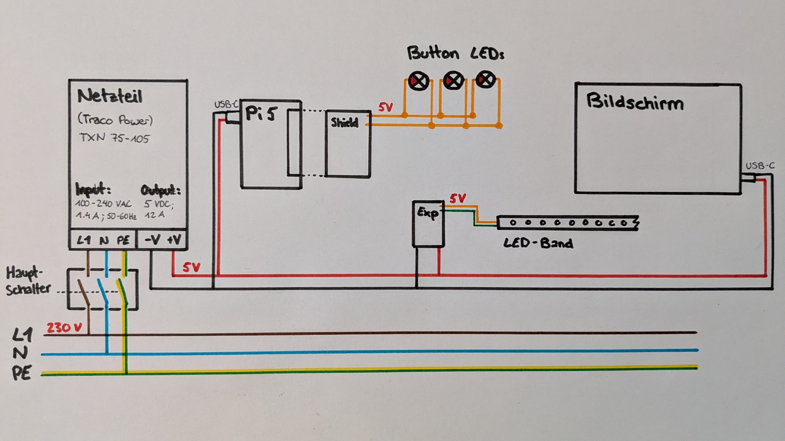
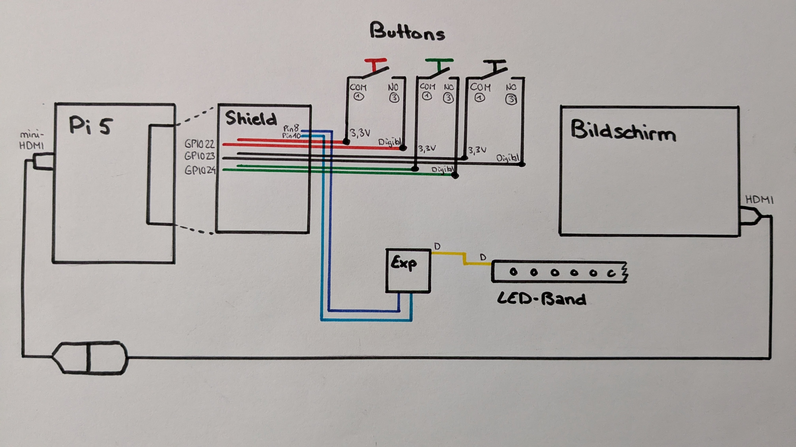
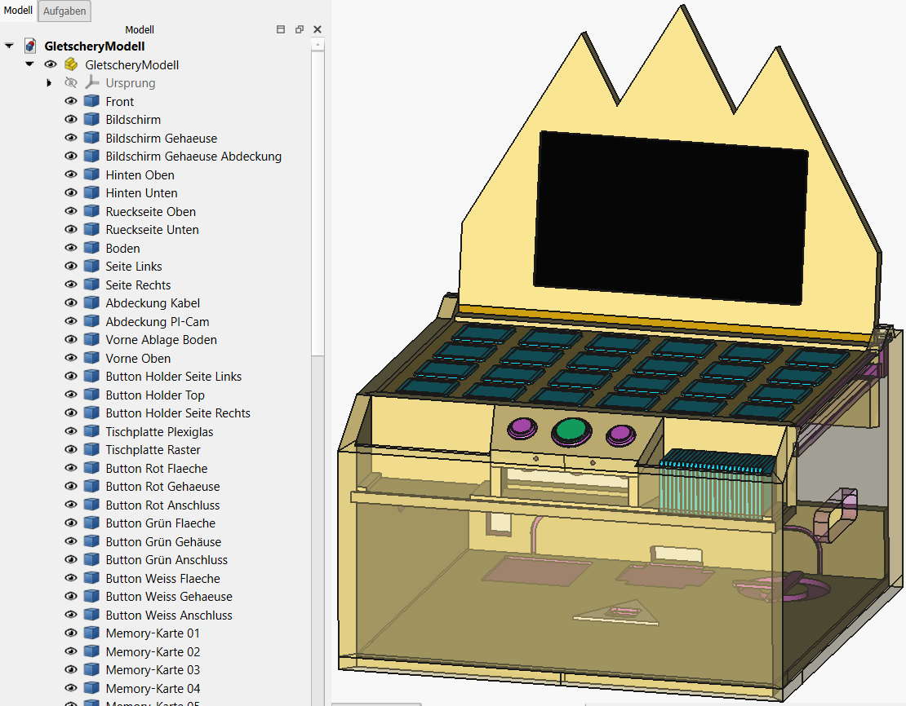
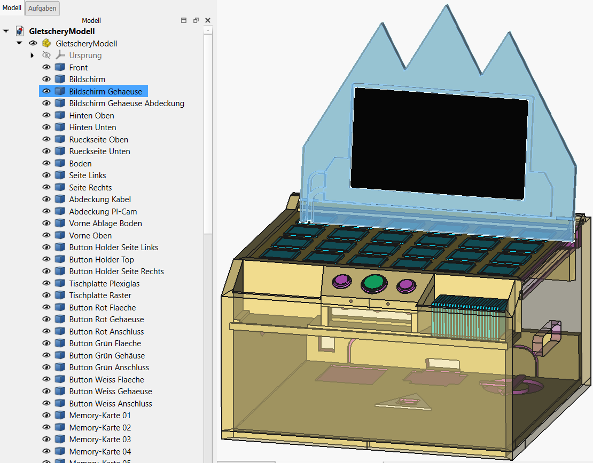

= Dokumentation Hardware
:toc-title: Inhalt
:toc: right
:toclevels: 4

== Komponentenübersicht
Die Hardware von Gletschery besteht im Wesentlichen aus:

* den PUI-Elementen, mit welchen der Spieler interagiert,
** Memory-Karten
** Arcade Buttons
** Monitor
* der Elektronik, welche die Funktionalität herstellt,
** Spannungsversorgung
** Zentraleinheit (Raspberry Pi)
** Kamera
** Licht
** diverse Kleinteile
* dem Gehäuse, welches alle Bestandteile vereint
** Holz-Bauteile
** Plexiglasplatte
** Farbe
** diverse Kleinteile

== Teileliste
Die Teileliste führt alle verbauten Bestandteile der Hardware von Gletschery auf.
Sie ist nach den Hauptbestandteilen der Komponentenübersicht gegliedert und gibt Auskunft über die Bezeichnung und die für uns entstandenen Kosten der einzelnen Bauteile.

Für weitere Details zu den einzelnen Komponenten folgen Sie den Links auf die Komponenten.

=== PUI

|===
|Komponenten |Bezeichnung |Beschaffung |Kosten

| Memory-Karten (24x)
| Eigenfertigung
| 3D-Druck
| 0.-

| xref:Komponenten/Arcade-Buttons.adoc[Arcade Buttons (3x)]
| Arcade Push Button illuminated (purecrea)
| Einkauf
| 15.70

| xref:Komponenten/Monitor.adoc[Monitor]
| PM-14 (verbatim)
| Einkauf
| 79.-

|===

=== Elektronik

|===
|Komponenten |Bezeichnung |Beschaffung |Kosten

| xref:Komponenten/Netzteil.adoc[Netzteil]
| TXN 75-105 (Traco Power)
| FHNW
| 0.-

| Hauptschalter
| Hauptschalter
| FHNW
| 0.-

| zentrale Steuereinheit
| Pi 5 (Raspberry)
| FHNW
| 0.-

| Shield
| Shield auf 40-Pin Header Pi (FHNW)
| FHNW
| 0.-

| xref:Komponenten/Kamera.adoc[Kamera]
| Camera Module 3 Wide (Raspberry)
| Einkauf
| 45.70

| xref:Komponenten/Kamera-Kabel.adoc[Kamera-Kabel]
| RASP CAM FPC 50 CSI (Raspberry)
| Einkauf
| 8.70

| LED-Band
| 5V LED-Band
| FHNW
| 0.-

| xref:Komponenten/LED-Steuerung.adoc[LED-Steuerung]
| Output Expander EM-03 (Pixelblaze)
| FHNW
| 0.-

| diverse Kabel
| Custom Eigenfertigung
| FHNW
| 0.-

|===

=== Gehäuse

|===
|Komponenten |Bezeichnung |Beschaffung |Kosten

| Holzgehäuse
| Custom Eigenfertigung Holz-Bauteile
| FHNW / Einkauf
| 19.45

| Kamera-Halter
| Eigenfertigung
| 3D-Druck
| 0.-

| Spielfläche
| Plexiglasplatte
| Einkauf
| 11.95

| Farbe
| FS Premium Buntlack S012.04
| Einkauf
| 15.95

| diverse Kleinteile
| Schrauben, Stifte, Scharniere
| eigene Werkstatt
| 0.-

|===

Die Gesamtkosten dieser Teileliste belaufen sich auf 196.45 CHF.

Dabei ist zu beachten, dass viele Bauteile kostenfrei von der FHNW zur Verfügung gestellt wurden und ein 1:1 Nachbau mit identischen Komponenten die Kosten um einiges erhöhen würden.

== Anschlussschemata

Die Schemata zeigen eine Übersicht über das Gesamtsystem der Spannungsversorgung und Signalverbindungen.

Einzelheiten auf welchen Steckplätzen welche Kabel angeschlossen sind sind unter den jeweiligen Komponenten zu finden:

* xref:Komponenten/Arcade-Buttons.adoc[Arcade Buttons (3x)]
* xref:Komponenten/LED-Steuerung.adoc[LED-Steuerung]

=== Spannungsversorgung

=== Signalverbindungen

== Files

=== STP - Gletschery Modell

* xref:3D-Files/GletscheryModell.step[GletscheryModell.step]
* Pfad: hardware/Files/GletscheryModell.step
* Das GletscheryModell im STEP Format beinhaltet alle Bauteile des Gehäuses

* Sollten Sie kein Programm haben um STP-/STEP-Dateien zu öffnen, empfehlen wir FreeCAD, ein kostenloses Open-Source CAD: https://www.freecad.org/
* Durch hovern über die Bauteile werden einzelne Komponenten hervorgehoben:

[#_stl__3d_druck_modelle]
=== STL - 3D Druck Modelle

* Alle 3D-Druckmodelle wurden mit einem Original Prusa MK3.9 0.4 nozzle Drucker hergestellt
* Als Filament wurde Generic PLA hellblau verwendet
* Als Referenz für weitere Druckeinstellungen dient das folgende PrusaSlicer Projekt:
** xref:3D-Files/memory-cards-v5.3mf[memory-cards-v5.3mf]
** Pfad: hardware/Files/memory-cards-v5.3mf

==== Memory-Karten

* xref:3D-Files/memory-cards-v4 60x60x5_R5.stl[memory-cards-v4 60x60x5_R5.stl]
* Pfad: hardware/Files/memory-cards-v4 60x60x5_R5.stl

==== Kamera-Aufnahme

* xref:3D-Files/PI-CamHolderV2.stl[PI-CamHolderV2.stl]
* Pfad: hardware/Files/PI-CamHolderV2.stl

=== Abmessungen

* Aussenabmessungen Gletschery geöffnet: 519 x 500 x 656
* Aussenabmessungen Gletschery geschlossen: 519 x 500 x 317

Alle Masse in mm.

Bei Bedarf können die Masse jedes beliebigen Bauteils aus der STEP-Datei xref:3D-Files/GletscheryModell.step[GletscheryModell.step] in einem beliebigen CAD ausgelesen werden.

== Inbetriebnahme

Nach dem initialen Deployment der Software auf dem Raspberry Pi inklusive Autostart (welches vom Projektteam übernommen wird) ist die Inbetriebnahme des Produktes ganz einfach:

Schritte für die Inbetriebnahme:

* Anschliessen Stromkabel an Netz
** öffnen Sie die Rückseite des Gehäuses (durch öffnen der zwei Scharniere) und entnehmen Sie das mitgelieferte lose Stromkabel
** Stecken Sie das Stromkabel an der Rückseite (rechts unten) an und verbinden Sie die andere Seite mit Ihrem Stromnetz.
* Betätigen Sie den Hauptschalter
** Der Hauptschalter befindet sich gleich über dem Anschluss des Stromkabels welches Sie gerade verbunden haben
* Autostart
** Der Bildschirm startet sich nach einschalten des Stroms automatisch.
** Der Pi fährt sich ebenfalls automatisch hoch und startet das Spiel.
* Willkommen im Hauptmenü
** Nach einer kurzen Ladephase landen Sie bequem im Hauptmenü des Spiels, von wo aus Sie verschiedene Möglichkeiten haben:
*** ein neues Spiel starten
*** Sprache auswählen
*** Spielanleitung betrachten
*** eine Diashow der verwendeten Fotos ansehen
*** Die Credits lesen

Abschalten des Systems:

* Das System kann einfach über den Hauptschalter abgeschaltet werden

== Wartung

[#_plexiglas_auswechseln]
=== Plexiglas auswechseln

Das Plexiglas kann zur Rückseite hin herausgezogen werden.Im aufgestellten Zustand sind jedoch das Bildschirmgehäuse und deren Verkabelung im Weg.

Folgende vorbereitenden Schritte sind notwendig um das Plexiglas auszuwechseln:

* Zuklappen des Bildschirmgehäuses
* 3 Schrauben auf der Rückseite des Bildschirmgehäuses lösen, sodass die Abdeckung abgenommen werden kann.
* Strom- und HDMI-Kabel am Bildschirm entfernen und beachten, dass diese unterhalb der Nut für das Glas liegen.
* Um besseren Zugang zu haben wird empfohlen, das gesamte Oberteil abzunehmen: dazu entfernen Sie die beiden Stifte auf den Seiten (am Bestem mittels Kneif- oder Gripzange), danach kann das Oberteil einfach abgenommen werden.
* Entfernen Sie nun alle Karten sowie das Raster von der Spielfläche

Folgende Schritte werden zum Auswechseln empfohlen:

* Tragen Sie Sicherheitshandschuhe
* Öffnen Sie die Rückklappe und greifen sie mit einer Hand hindurch um die Plexiglasplatte von unten (nahe den Buttons) etwas in Richtung der Rückseite zu ziehen.
* Greifen Sie das Glas von oben mittig am entstandenen Spalt und drücken Sie es gleichmässig zur Rückseite hinaus
* Sobald das Glas über die Rückseite herausragt, ziehen Sie es von hinten hinaus.

Einschieben des neuen Glases

* Tipp: Schutzfolie nur an den Rändern etwas entfernen, sodass die Fläche beim Einschieben geschützt bleibt.
* Von der Rückseite her das Glas gleichmässig einschieben
* Wenn das Glas an der Vorderseite ansteht, durch die Rückklappe von unten mit einer Hand etwas anheben und mit der anderen Druck von Hinten geben, bis es schön in der Nut sitzt.
* Das Glas sitzt korrekt, sobald es auf der Rückseite vollständig bündig mit der Abdeckung ist.

Oberteil wieder anbringen:

* Legen Sie das Oberteil flach in Position
* Schieben Sie einen Stift von der Seite ein (durch leichtes Bewegen des Oberteils merken Sie, wann der Stift gefasst hat)
* Setzen Sie den Stift auf der gegenüberliegenden Seite
* Das Oberteil ist nun wieder befestigt
* Schliessen Sie Strom- und HDMI-Kabel an und legen Sie die Kabel in die entsprechenden Kanäle
* Schrauben Sie die Abdeckung wieder an.

=== Memory-Karten

Die Memory-Karten bestehen aus einem 3D gedruckten Körper, einem Gletscherfoto auf einer Seite und einem (dem Foto zugeordneten) QR-Code auf der anderen Seite.

Die Fotos/QR-Codes sind auf normales Papier gedruckt, laminiert und mit einem starken doppelseitigen Klebeband auf den Kartenkörper geklebt.

==== Karten-Körper

Es werden 8 Ersatzkarten mitgeliefert. Um selbständig Karten zu drucken, finden Sie weiter oben in diesem Dokument einige Infos, STL-Files sowie ein Druckprojekt, welches Sie verwenden können ->
xref:HardwareDokumentation.adoc#_stl__3d_druck_modelle[STL Modelle]

==== Gletscher-Fotos

Diese Doku beinhaltet 2 PDFs mit druckfertigen Fotos in der richtigen Grösse für die Karten. Einmal mit und einmal ohne Namen. Sollten Sie Anpassungen machen wollen, können Sie gerne das .docx als Vorlage nehmen:

* xref:Documents/eigene/All-Gletscher-Images 46mm.pdf[]
* xref:Documents/eigene/All-Gletscher-Images 46mm mit Label.pdf[]
* xref:Documents/eigene/All-Gletscher-Images 46mm.docx[]

==== QR-Codes

Druckfertige QR-Codes in der richtigen Grösse finden Sie in folgenden Dokumenten:

* xref:Documents/eigene/All-QR-Codes Table 42mm.pdf[]
* xref:Documents/eigene/All-QR-Codes Table 42mm.docx[]

==== Zuordnung

Die Zuordnung der Codes zu den Gletschern, sowie den angezeigten Texten findet in einem JSON-File statt. Infos dazu finden Sie in der

* xref:../software(sad)/Deployment_Anleitung.adoc#_daten[Deployment Anleitung unter Daten]

Die standalone Texte mit den Fakten finden Sie ansonsten in folgenden Dokumenten:

* xref:Documents/eigene/Fakten Gletscher DE.docx[]
* xref:Documents/eigene/Fakten Gletscher EN.docx[]
* xref:Documents/eigene/Fakten Gletscher FR.docx[]

=== Arcade-Buttons

Sollten Sie die Buttons auswechseln müssen, so ist dies möglich, aber nicht ganz einfach :)

Details zu den Buttons (Link zum Händler und elektrische Anschlüsse) finden Sie hier: xref:Komponenten/Arcade-Buttons.adoc[Arcade-Buttons]

* Folgen Sie der Anleitung xref:HardwareDokumentation.adoc#_plexiglas_auswechseln[Plexiglas auswechseln] bis zu dem Schritt an welchem Sie das Glas entfernt haben, um besseren Zugang zu haben.
* Nun können sie die Unterseite des auszuwechselnden Buttons (dort wo die Kabel angeschlossen sind) ein wenig gegen den Uhrzeigersinn drehen (dabei brauchen Sie initial etwas mehr Kraft als Sie erwarten würden, Sie merken jedoch schnell wenn es sich löst)
** (das Unterteil wird, beim Zusammenbau, zuerst in einer L-Nut gerade nach oben zusammengesteckt und dann etwas im Uhrzeigersinn gedreht, wodurch die Komponenten zusammenhalten - diesen Schritt gilt es umgekehrt zu machen)
** Sollte sich der gesamte Button Drehen, so geben Sie von der Oberseite Gegen-Druck auf den schwarzen Rand (aber nicht auf die Druckfläche - dies verhindert ein Lösen!)
* Nun kann das Unterteil des Buttons gerade nach unten herausgezogen werden. Die Kabelschuhe wurden für den besseren Halt gelötet.
** Sollten Sie diesen Teil auswechseln müssen so muss das Lot gelöst werden
** Markieren Sie sich unbedingt die Kabel auf der Button-Seite bevor Sie diese lösen, sodass Sie beim Ersetzen wissen, welche Anschlüsse wohin kommen. Die Anschlüsse auf Seite Pi/Shield sind entsprechend beschriftet.
* Um den Button / Oberen Teil zu entfernen, lösen Sie die Plastik-Mutter auf der Innenseite (nach Entfernen des Unterteils)
** Danach können Sie den gesamten Button von unten am Plastikgewinde gerade nach oben herausdrücken
** (Das Plastikgewinde dient nur dem Anziehen der Mutter, das Gehäuse selbst ist keine Gewinde- sondern eine Durchgangsbohrung)

== Erweiterbarkeit

Ideen zur Weiterentwicklung / Ausbau:

=== Spielfläche

* Weitere Raster um Anzahl Memory-Karten zu lenken
* Oder Sie versuchen das Raster wegzulassen, um die Technik sichtbarer zu machen. (wir hatten ohne Raster begonnen uns jedoch wegen folgenden Problemen für eines entschieden)
** mehr Probleme mit dem Auto-Fokus der Kamera auf entfernte Decken-Elemente
** weniger zuverlässige Erkennung der QR-Codes bei schräg liegenden Karten

=== Beleuchtung

* Die verbauten LEDs sind individuell steuerbar und RGB fähig
** Sie können das Innere in verschiedenen Farben oder Leuchtsequenzen zu neuem Leben erwecken
** Wir hatten beispielsweise während einiger Zeit bei einem richtigen Paar grün und bei einem falschen Paar oder Scan-Misserfolg rot angezeigt was richtig gut aussah (später jedoch wieder weggelassen, wir die Bildnachbearbeitung auf helles weisses Licht optimiert hatten)

=== Inhalt

* Auswechseln von Motiven und Texten ist ziemlich einfach in einem JSON-File möglich. Seien Sie kreativ.

=== Software

* Wie wäre es mit weiteren Spielmodi: zB einem Singleplayer oder Ranglisten-Modus

