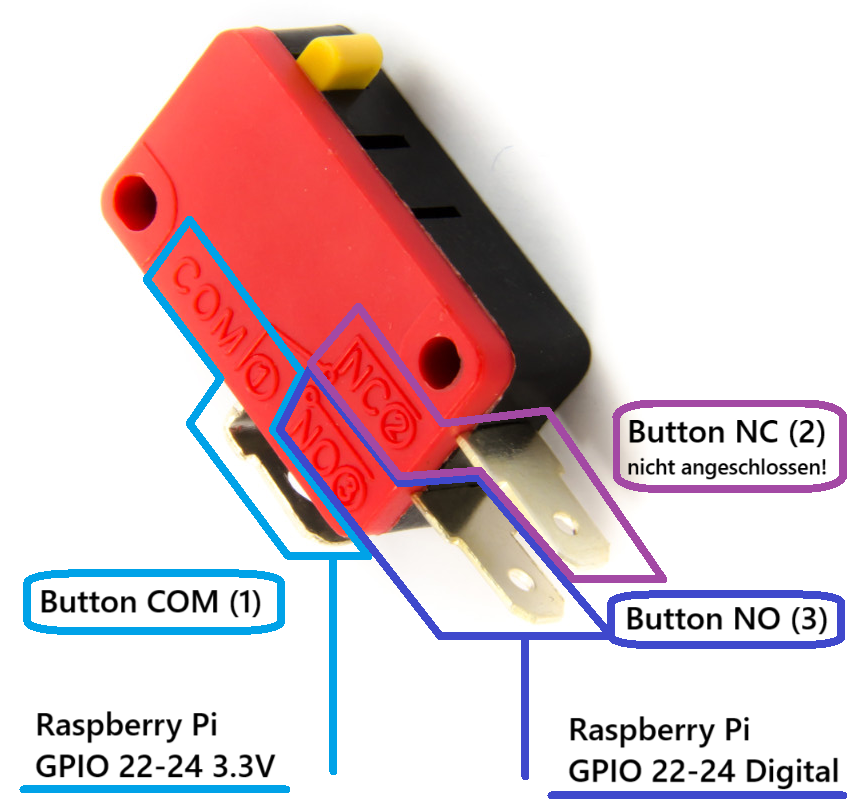

= Arcade Buttons

|===
|Key specifications |details

|Hersteller
|purecrea

|Model
|Arcade Push Button Illuminated

|Spannungsversorgung LED
|5-12V

|Preis
|33mm: CHF 4.90; 45mm: 5.90

|Produktlink
|https://www.bastelgarage.ch/illuminated-arcade-button-33mm-red[Link zu 33mm Red auf bastelgarage.ch]

https://www.bastelgarage.ch/components/switch-button/arcade-push-button-illuminated-33mm-white[Link zu 33mm White auf bastelgarage.ch]

https://www.bastelgarage.ch/components/switch-button/arcade-push-button-lit-45mm-green[Link zu 45mm Green auf bastelgarage.ch]
|===

== Anschlüsse Signalverbindungen

== Anschlüsse Stromversorgung

Die LED's der Buttons haben einen eigenen Stromkreis. Sie wurden von uns so zusammengebaut, dass der Anschluss auf der roten Seite dem 5V+, derjenige auf der schwarzen Seite dem 5V- auf dem Netzteil entspricht