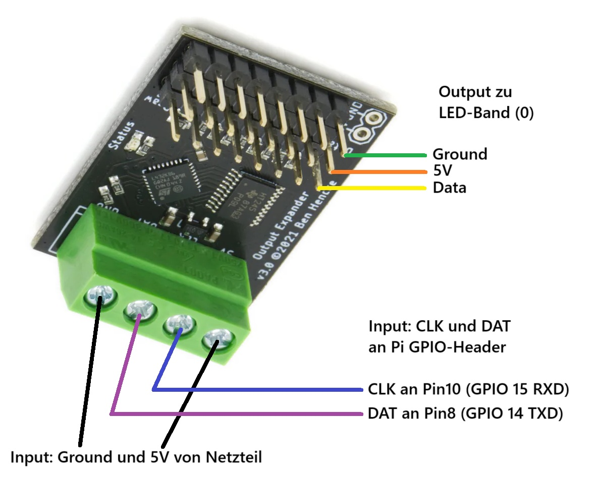

= LED-Steuerung

|===
|Key specifications |details

| Hersteller
| Pixelblaze

|Model
|Output Expander EM-03

|weitere Dokumente
|https://electromage.com/docs/output-expander[Output Expander Documentation]

|Produktlink
|https://shop.electromage.com/products/pixelblaze-output-expander-serial-to-8x-ws2812-apa102-driver[Link zum Produkt des Herstellers]
|===

Der Output Expander ist für die Steuerung und Spannungsversorgung des LED-Bands zuständig.

* Die Inputs 5V und GND sind direkt am Netzteil angeschlossen.
* Die Inputs DAT und CLK sind mit den GPIO-Pins 8 und 10 des Pi verbunden.
* Die Outputs 5V, GND und Data sind auf Reihe 0 mit den entsprechenden, gleich bezeichneten, Counter-Parts am LED-Band verbunden.

== Anschlüsse

