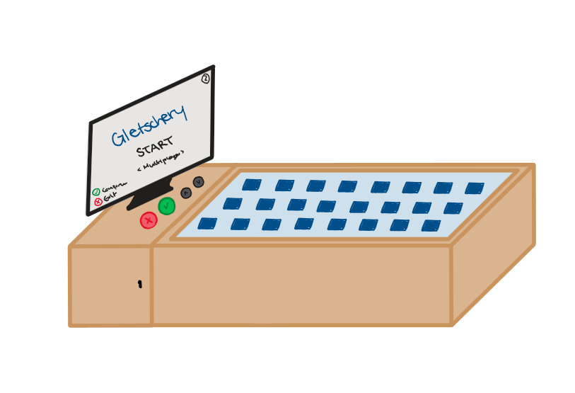
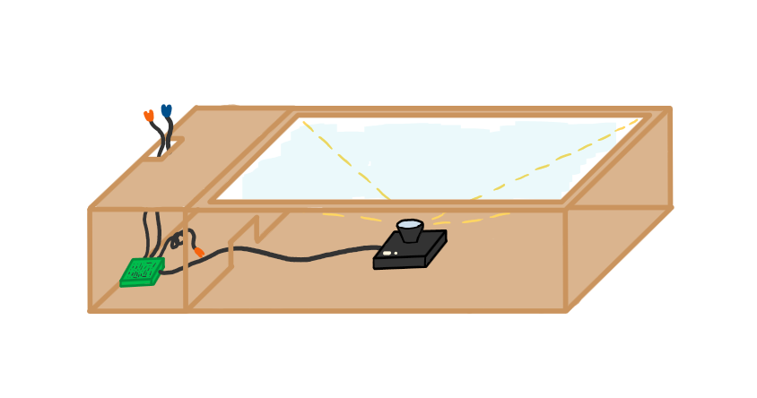

[[section-introduction-and-goals]]
==	Einführung und Ziele
Dieses Projekt wurde im Rahmen der Projektarbeit IP12 der FHNW erarbeitet.

=== Aufgabenstellung
==== Ziel des Projektes
Das Ziel des Projekts ist die Entwicklung eines Memory-Spiels, das spielerisch Wissen über die Gletscherschmelze vermittelt. Das Spiel kombiniert klassische Elemente des Karten-Memorys mit moderner Technologie: Jede Karte trägt einen QR-Code, der beim Umdrehen durch ein Kameramodul gescannt wird. Das System prüft gefundene Paare, verarbeitet die Informationen und gibt den Spielern eine grafisch aufbereitete Rückmeldung auf einem Bildschirm aus. Das Spiel soll sowohl unterhalten als auch aufklären und wird mit besonderem Fokus auf Umweltbildung gestaltet.

.Treibende Kräfte
* Hauptfunktionalitäten:
** QR-Code-Erkennung
** Spielüberprüfung
** Ausgabe informativer Texte
* Qualitätsziele:
** Effizienter Ressourcenverbrauch
** Barrierefreiheit
* Systemanforderungen:
** Integration Kameramodul
** Displayausgabe
* Zielgruppe:
** Jugendliche (13 bis 16 Jahre, 7-9 Klasse)
** Familien
** Lehrkräfte
* Technologische Anforderungen:
** Java-basierte Software
** Einsatz von den Bibliotheken ZXing und OpenCV

.Erster Entwurf - Memory mit Screen von Aussen

.Erster Entwurf - Memory ohne Screen von innen

=== Qualitätsziele

image::../images/01_2_iso-25010-topics-DE.drawio.png["Kategorien von Qualitätsanforderungen"]

In diesem Projekt haben wir uns speziell auf **drei** Qualitätsziele festgelegt, auf die wir uns fokussieren.
|===
|Qualitätsziel |Beschreibung

| **Leistungseffizienz** |
 Das Produkt soll schnell und zuverlässig reagieren. Wartezeiten sollen möglichst kurz gehalten werden. Eingaben sollen zeitnah bearbeitet werden.

| **Benutzerfreundlichkeit** | Unsere Zielgruppe sind Schüler in der 7. bis 9. Klasse. Um zu vermeiden, dass viel Zeit beim Verstehen des Spiels aufgewendet wird, ist wichtig, dass das Spiel benutzungsfreundlich und selbsterklärend ist. Dabei soll die Barrierefreiheit berücksichtigt werden.

| **Wartbarkeit** |
Das Produkt soll möglichst ohne Interventionen von aussen funktionieren.

Die Inhalte der Karten, Sprachen sowie Spielcharakter und Hintergrund soll austauschbar sein und über ein Json angepasst werden können.

|===
Qualitätsanforderungen: link:10_quality_requirements.adoc[Kapitel 10]

=== Stakeholder

[cols="1,1" options="header"]
|===
|Rolle |Interessen
| **Spieler (Jugendliche zwischen 13 und 15 Jahren, 7.-9. Klasse)** | Wollen durch das Spiel unterhalten werden und gleichzeitig etwas über Gletscher, Gletscherschmelze und dessen Auswirkungen erfahren.
| **Familien** | Wollen durch das Spiel unterhalten werden und gleichzeitig etwas über Gletscher, Gletscherschmelze und dessen Auswirkungen erfahren.
| **Lehrpersonen** | Wollen den Schülern eine spassige Erfahrung ermöglichen und dabei etwas über die Gletscher und Gletscherschmelze vermitteln.
| **Primeo Energie** | Will den Besuchern eine gute Erfahrung bieten und etwas über die Gletscher und Gletscherschmelze vermitteln.
Ausserdem möchten sie ein wartungsarmes, robustes Produkt.
| **Entwickler** | Wollen den Kunden ein qualitativ hochwertiges und vollständiges Produkt liefern.
|===
