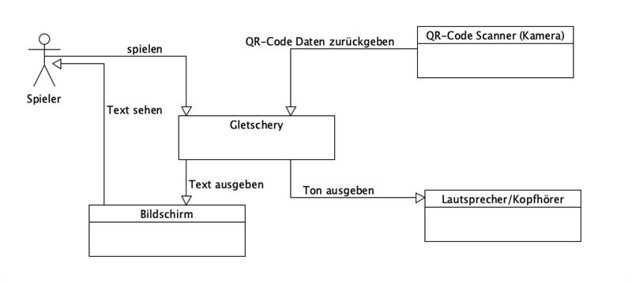

[[section-system-scope-and-context]]
== Kontextabgrenzung
=== Fachlicher Kontext

.Spieler
Unser Spiel wird speziell für **13- bis 15-jährige Jugendliche** erstellt. Die Spieler spielen ein Memory auf einer durchsichtigen Oberfläche und versuchen die passenden Karten auf der Fläche zu finden und umgedreht wieder auf die Oberfläche zu legen, damit unser System die QR-Codes lesen kann.

Festlegung *aller* Kommunikationsbeziehungen (Nutzer, IT-Systeme, ...) mit Erklärung der fachlichen Ein- und Ausgabedaten oder Schnittstellen.
Zusätzlich (bei Bedarf) fachliche Datenformate oder Protokolle der Kommunikation mit den Nachbarsystemen.

=== Technischer Kontext

==== Technische Schnittstellen
1. **Kamera (QR-Code) - Raspberry Pie Camera Module 3 Wide:**
** **Kanal**: USB- oder GPIO-Schnittstelle am Raspberry Pi.
** **Protokoll**: Bilddaten werden von der Kamera erfasst und mit der Library ZXing verarbeitet.
** **Funktion**: Überträgt Kamerabilder für die QR-Code-Erkennung an die ZXing-Library.

2. **Display - Verbatim Portable Monitor 14" Full HD 1080p PM-14**:
** **Kanal**: HDMI-Schnittstelle.
** **Protokoll**: Videoausgabe erfolgt über den Raspberry Pi 5 HDMI Anschluss.
** **Funktion**: Zeigt Textinformationen und Spielrückmeldungen an.

3. **Raspberry Pie 5:**
** **Kanal:** Stromanschluss
** **Funktion:** Grundlage für das ganze Spiel. Die Software läuft auf dem Raspberry Pie. Alle Hardware Komponenten ist an dem Raspberry Pie angeschlossen.

==== Bestellungen
[cols="1,1, 1", options="header"]
|===
| **Produkt** | **Beschreibung** | **Preis**

| Raspberry Pie Camera Module 3 Wide | Kamera Modul | CHF 45.70
|Verbatim Portable Monitor 14" Full HD 1080p PM-14| Bildschirm| CHF 79.00
|Raspberry Pi RASP CAM FPC 50 camera cable [1x CSI - 1x CSI] 0.50m orange| Kabel für Kamera| CHF 8.50
|===

.Anforderungen an Libraries
[cols="1,1", options="header"]
|===
| **Ansteuern der Kamera** | **Scannen der QR-Codes**

| Muss kompatibel sein mit der Kamera, die wir verwenden
| Bibliothek muss in der Lage sein, mehrere QR-Codes gleichzeitig zu scannen

| Kostengünstig oder kostenlos
| Die Bibliothek darf nicht zu viel Speicher auf dem Raspberry Pi beanspruchen

|
| Die Bibliothek darf nicht länger als zwei Sekunden brauchen, um QR-Codes zu scannen

|
| Kostengünstig oder kostenlos
|===
.Liste der verwendeten Libraries
[cols="1,1", options="header"]
|===
| **Bibliothek** | **Funktion**

| **OpenCV** (wird nicht mehr verwendet wegen neuer Kamera, die keine externe Library benötigt)
| Ansteuern der Kamera

| **ZXing**
| Auswerten der QR-Codes

| **Libcamera**
| über einen Bashbefehl wird Libcamera benutzt, um Aufnamen der QR codes zu machen.
|**FFMEG**|
FFMPEG wird verwendet, um aus dem Video Stream von Libcamera regelmässig Screenshots zu speichern.
|===

Zu Beginn haben wir eine Webcam eines Teammitglieds ausgeliehen, um unsere Ideen auszuprobieren und die auf Papier ausgedruckten QR-Codes auslesen zu können. Dabei haben wir die kostenlosen Libraries ZXing für die Auswertung der QR-Codes und OpenCV für die Steuerung der Kamera verwendet. Die Library OpenCV wurde jedoch schnell verworfen, da wir uns für eine Pi-Cam entschieden haben. Diese lässt sich effizienter über die interne Bash des Raspberry Pi steuern, was die Performance erheblich verbessert.
