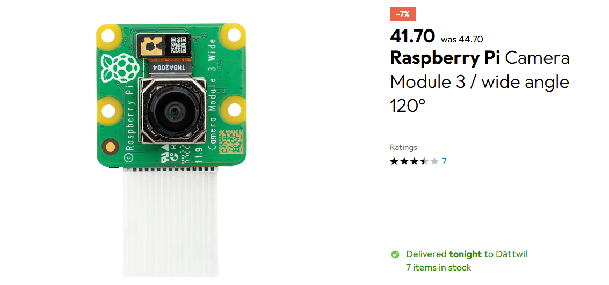
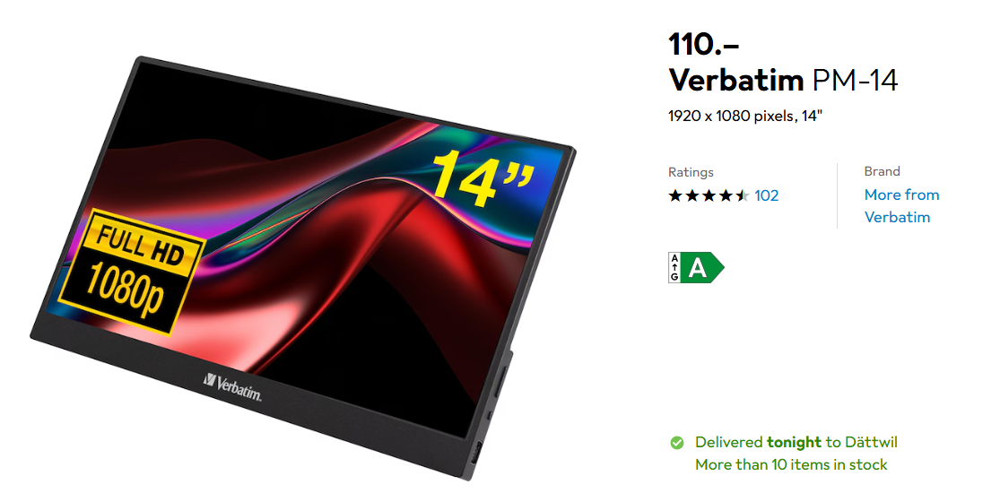
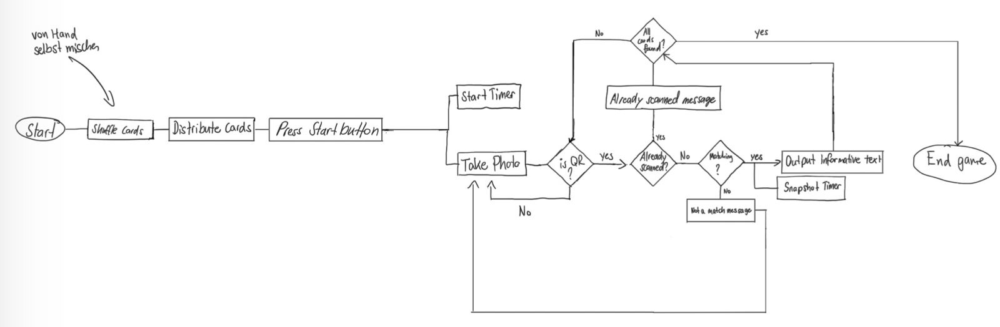
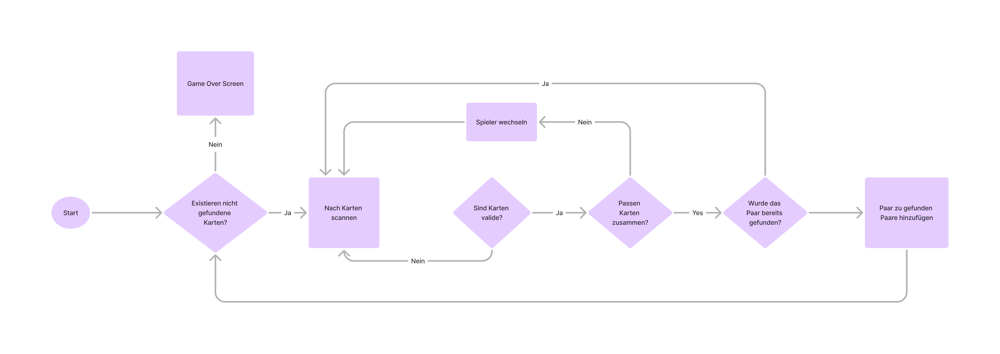

[[section-solution-strategy]]
== Lösungsstrategie

[role="arc42help"]
****
.Inhalt
Kurzer Überblick über die grundlegenden Entscheidungen und Lösungsansätze, die Entwurf und Implementierung des Systems prägen.
Hierzu gehören:

* Technologieentscheidungen
* Entscheidungen über die Top-Level-Zerlegung des Systems, beispielsweise die Verwendung gesamthaft prägender Entwurfs- oder Architekturmuster,
* Entscheidungen zur Erreichung der wichtigsten Qualitätsanforderungen sowie
* relevante organisatorische Entscheidungen, beispielsweise für bestimmte Entwicklungsprozesse oder Delegation bestimmter Aufgaben an andere Stakeholder.

.Motivation
Diese wichtigen Entscheidungen bilden wesentliche „Eckpfeiler“ der Architektur.
Von ihnen hängen viele weitere Entscheidungen oder Implementierungsregeln ab.

.Form
Fassen Sie die zentralen Entwurfsentscheidungen *kurz* zusammen.
Motivieren Sie, ausgehend von Aufgabenstellung, Qualitätszielen und Randbedingungen, was Sie entschieden haben und warum Sie so entschieden haben.
Vermeiden Sie redundante Beschreibungen und verweisen Sie eher auf weitere Ausführungen in Folgeabschnitten.

.Weiterführende Informationen

Siehe https://docs.arc42.org/section-4/[Lösungsstrategie] in der online-Dokumentation (auf Englisch!).

****
=== Design Entscheidungen
==== QR-Code vs Bar-Code
Für das Matching der Karten wurden hauptsächlich zwei Methoden QR-Codes und Bar-Codes in Betracht gezogen.

=== Technologie Entscheidung
=== Übersicht der Technologieentscheidungen
[cols="1,2,1", options="header"]
|===
| Komponente     | Entscheidung                 | Preis (CHF)
| Kamera         | Raspberry Pi Camera Module 3 |  CHF 41.70
| Bildschirm     | Verbatim PM-14               |  CHF 110
| Software       | Java, ZXing                  | kostenlos
| Steuerung      | GPIO-Knöpfe mit Python/Java  | ca. CHF 10
| Gehäuse        | Holzbox mit Glasfläche       | - (teils von der FHNW zur Verfügung gestellt)
| *Total*        |                              | -
|===

==== Box für die Hardware
Für die Prototyp-Box wurde besonders darauf geachtet, dass eine Glasfläche verwendet wird, durch die die Kamera problemlos die QR-Codes erkennen kann. Die Box aussen wurde aus Holz gebaut aus Stabilitätsgründen.

==== Kamera (Raspberry Camera Module 3)

Die Kamera ist ein wichtiger Bestandteil unseres Produktes und steht im Zentrum unserer Implementierung. Sie wird verwendet, um die Karten auf der Glasfläche zu scannen und dessen Input an den Raspberry Pie weiterzugeben. Damit wir sicher gehen konnten, dass eine Kamera für unser Projekt geeignet ist, wurden Kriterien festgelegt, nach denen wir Kameras aussortiert haben.

.Kriterien

* Liegt die Kamera in unserem **Budget von CHF 200**
* Kann die Kamera in **dunklen Umgebungen** genug klare Bilder machen
* Kann die Kamera in **hellen Umgebungen** genug klare Bilder machen
* Hat die Kamera eine genug gute **Brennweite**, um 24 Karten gleichzeitig auf der Glasfläche zu erkennen.
* Wie **effizient** kann die Kamera mit dem Raspberry Pie kommunizieren und **wie viel Leistung** nimmt sie in Anspruch.

Aufgrund des begrenzten Budgets von CHF 200 war unsere Auswahl an Kameras eingeschränkt. Zunächst durchsuchten wir bekannte Onlineshops nach Kameras, die unseren Anforderungen entsprachen. Da der Hersteller des Raspberry Pi selbst eine Kamera anbietet, die alle gewünschten Kriterien erfüllt, war die Entscheidung für diese Kamera naheliegend.

==== Bildschirm (Verbatim PM-14)

Dadurch, dass die Box, in der die ganze Hardware unseres Spiels eingebaut werden soll, portabel sein sollte, haben wir uns entschieden einen kleineren Bildschirm zu wählen. Ein weiteres Kriterium für die Auswahl war das Budget von CHF 200, das uns weiterhin eingeschränkt hat.

.Kriterien
* Budget von CHF 200
* Muss kompakt sein
* HDMI Anschluss
* Kompatibel mit Raspberry Pie

Der Bildschirm wurde mit dem Hintergedanken bestellt, dass dieser wieder zurückgesendet werden kann. Nach dem Benutzen und Testen des Bildschirmes sind wir auf den Entscheid gekommen ihn weiterhin zu verwenden.
=== Umsetzung der Qualitätsanforderungen

[cols="1,1,1", options="header"]
|===
| Qualitätsziel | Problem | Lösung

| **Benutzerfreundlichkeit**
| Personen mit Sehbehinderungen oder Farbenblindheit könnten wichtige Informationen auf dem Bildschirm nicht erkennen.
| Spielelemente (z.B. Buttons) sind mit klaren, gut erkennbaren Symbolen versehen. Farbmarkierungen werden zusätzlich durch eindeutige Formen unterstützt.

| **Benutzerfreundlichkeit**
| Die Spieler verstehen nicht, was passiert, wenn sie ein falsches Kartenpaar wählen (keine oder unklare Rückmeldung).
| Der Spieler erhält auf dem Bildschirm ein deutliches visuelles Feedback, ob das Kartenpaar richtig oder falsch ist. Die Rückmeldung wird mit Farben verstärkt.

| **Wartbarkeit**
| Das Projekt wird an eine externe Partei übergeben. Fehlende technische Dokumentation könnte die Wartung erschweren.
| Der Quellcode ist mit JavaDoc dokumentiert und die Spielinhalte sind in einer separaten JSON-Datei abgelegt. Das Software-Architektur-Dokument (SAD) beschreibt die Abläufe und erleichtert die Wartung.

| **Wartbarkeit**
a|
* Eine neue Sprache soll hinzugefügt werden.
* Kartenpaare sollen ersetzt werden.
* Informationen zu Gletscher sollen angepasst werden.

| Spielinhalte können einfach in der separaten JSON-Datei ergänzt werden und werden beim Neustart des Spiels automatisch geladen.

| **Leistungseffizienz**
| Die Spieler sollen nach dem Aufdecken eines Kartenpaars nicht länger als 1 Sekunde auf eine Rückmeldung warten müssen.
| Bereits beim Spielstart wird der Scanprozess aktiviert. Die Kamera nimmt laufend Bilder auf und scannt fortlaufend nach QR-Codes.

Wenn der Scan-Button gedrückt wird, wird das zuletzt erkannte Scanresultat sofort verwendet und angezeigt. Dadurch verkürzt sich die Wartezeit auf unter 1 Sekunde.
|===

=== Spielelogik
Vor dem Programmieren wurden sich Gedanken über den Spieleablauf gemacht und als handskizzierte Flussdiagramm dargestellt:

==== Flussdiagramme für Spielelogik

Die Spiellogik wurde in mehreren Iterationen entwickelt und durch handskizzierte sowie digitalisierte Flussdiagramme visualisiert. Ziel war es, den Spielablauf klar zu strukturieren, typische Fehlerfälle frühzeitig zu erkennen und die Benutzerführung konsistent umzusetzen.

.Erste Version des Flussdiagramms

Die erste Version diente als Grundlage zur Implementierung der Grundfunktionen. Sie veranschaulicht den grundlegenden Ablauf des Spiels: Karten scannen, Vergleich von zwei ausgewählten Karten, Rückmeldung für den Spieler und Übergang zur nächsten Runde.

.Zweite Version der Spielelogik

Während der Entwicklung stellte sich heraus, dass die ursprüngliche Logik zu Problemen führte z.B. bei fehlerhaften Vergleichen oder der Handhabung mehrfach erkannter Karten. Die überarbeitete Version berücksichtigt diese Fälle, verbessert die Kontrolle über Zustände und stellt sicher, dass Spieler-Feedback immer korrekt erfolgt. Diese Version ist konsistenter und robuster.

.Finale Version der Spielelogik
image::../images/06_Flussdiagramm_Spielablauf.png[Flussdiagramm Spielablauf Finale Version]

Die finale Version des Flussdiagramms bildet den gesamten Spielzyklus präzise ab, von Spielstart über das Umdrehen und Erkennen von Karten bis hin zur Ermittlung des Gewinners. Besonderes Augenmerk wurde auf die Behandlung von Fehlerfällen (z.B. keine Karten erkannt, zu viele Karten, Paar bereits gefunden) und die Benutzerführung gelegt. Die Entscheidungspfade sorgen dafür, dass der Benutzer jederzeit korrektes Feedback erhält und das Spiel nie in einen inkonsistenten Zustand gelangt. Durch diese strukturierte Logik ist der Spielablauf robust und leicht nachvollziehbar, was sowohl die Implementierung als auch die Testbarkeit deutlich vereinfacht hat.

