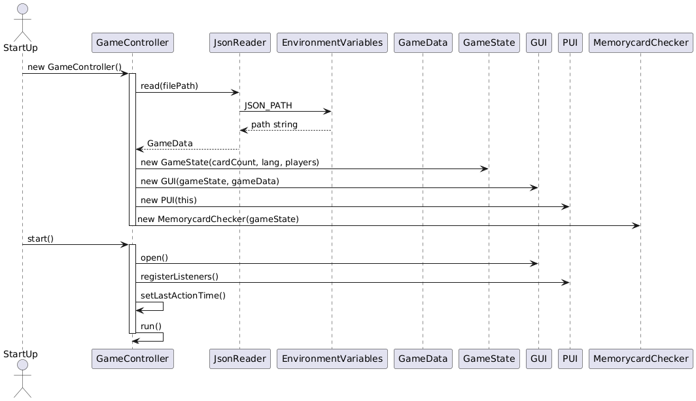
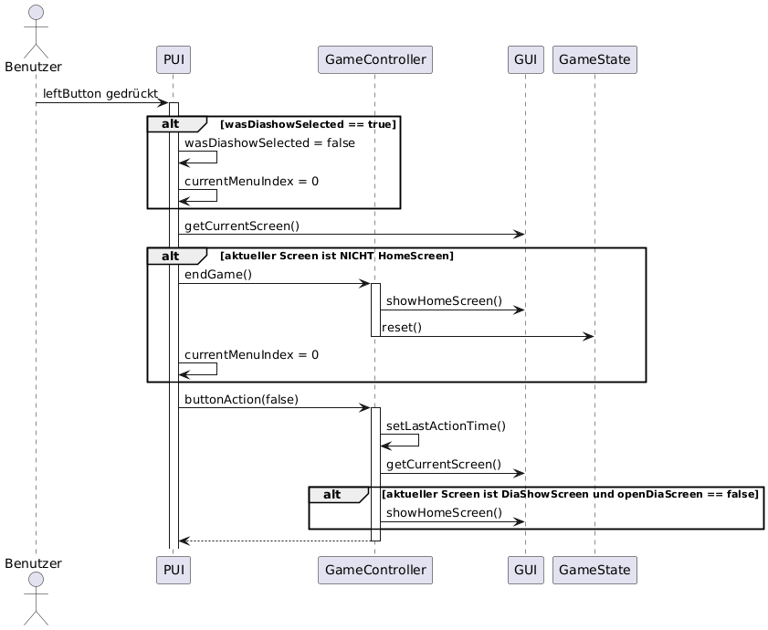
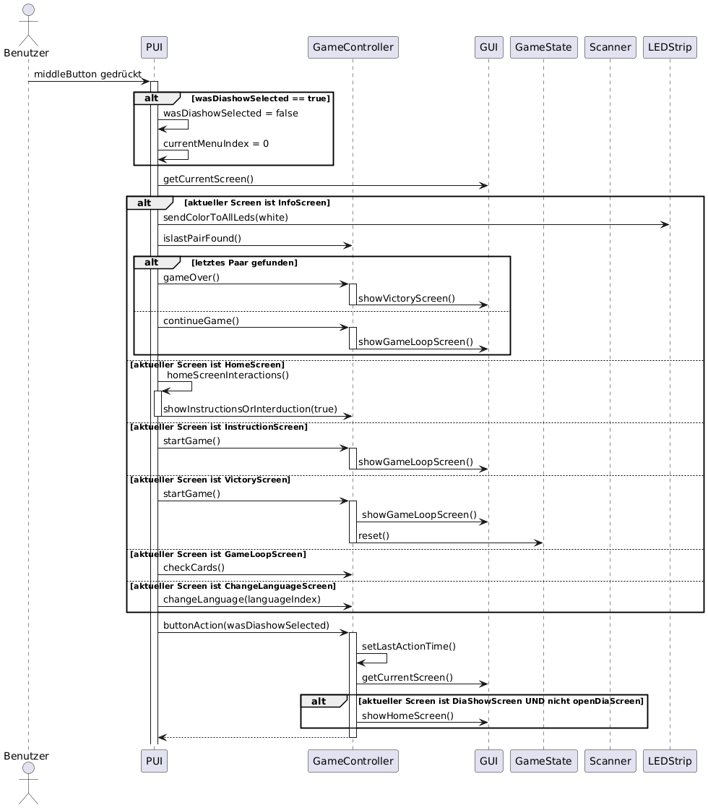
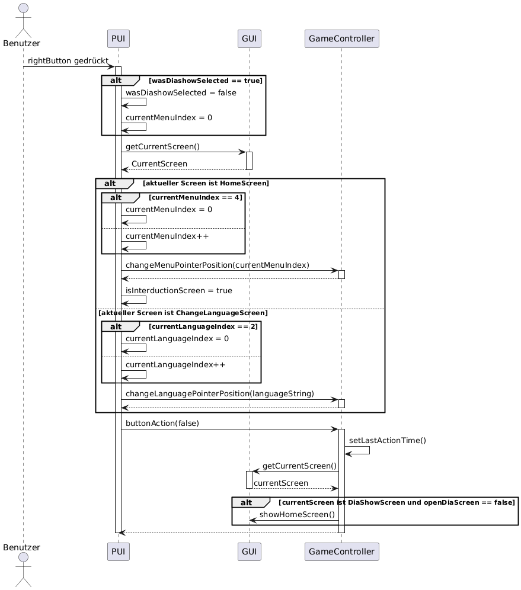
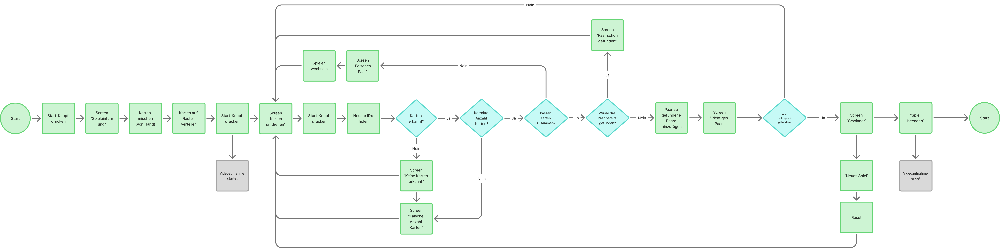

== Laufzeitsicht

=== Laufzeitszenario Start-Up

* Der Ablauf der Startsequenz zeigt, wie der `GameController` das `GUI` öffnet, die `PUI`-Listener aktiviert und danach die kontinuierliche GUI-Aktualisierung über `run()` startet.

=== Laufzeitszenario Knopfdruck (Rot)

* Beim Drücken des linken Buttons wird geprüft, ob sich das System im Diashow-Modus befindet. Falls ja, wird dieser beendet. Andernfalls wird geprüft, ob sich das System nicht im HomeScreen befindet – in diesem Fall wird das Spiel beendet und der HomeScreen angezeigt. Danach wird `buttonAction(false)` aufgerufen, um ggf. von der Diashow zum HomeScreen zu wechseln.

=== Laufzeitszenario Knopfdruck (Grün)

* Der mittlere Button ist der komplexeste der drei Knöpfe. Abhängig vom aktuell aktiven Screen führt der Button unterschiedliche Aktionen aus:
** `InfoScreen`: Farbe wird zurückgesetzt, danach je nach Spielstand entweder `gameOver()` oder `continueGame()` aufgerufen.
** `HomeScreen`: leitet die Methode `homeScreenInteractions()` ein, welche je nach Auswahl im Menü (Start, Anleitung, Sprache, Credits, Diashow) eine entsprechende Aktion im Controller triggert.
** `InstructionScreen` oder `VictoryScreen`: startet das Spiel via `startGame()`.
** `GameLoopScreen`: überprüft Karten via `checkCards()`.
** `ChangeLanguageScreen`: wechselt die Sprache basierend auf dem aktuell gewählten Index.
Anschliessend wird stets `buttonAction(wasDiashowSelected)` aufgerufen, was je nach Zustand den Screen zurück zum HomeScreen wechselt.

=== Laufzeitszenario Knopfdruck (Weiss)

* Beim Drücken des rechten Buttons wird ebenfalls geprüft, ob das System im Diashow-Modus ist. Falls ja, wird dieser zurückgesetzt.
** `HomeScreen`: Der Menüzeiger wird weitergeschaltet und `changeMenuPointerPosition()` aufgerufen.
** `ChangeLanguageScreen`: Der Sprachzeiger wird weitergeschaltet und `changeLanguagePointerPosition()` aufgerufen.
Danach wird `buttonAction(false)` ausgelöst, was ggf. den DiaShow-Screen beendet.

=== Laufzeitszenario Spielfluss

* Dieses Diagramm zeigt die Zustandswechsel während des eigentlichen Spielverlaufs: Scannen von Karten, Erkennung von Paaren, Spielerwechsel und Abschluss des Spiels.

.Typischer Fehlerfall: Zu viele Karten erkannt
Ein Spieler hält versehentlich drei Karten vor die Kamera. Das System erkennt dies anhand der QR-Ergebnisse und zeigt die entsprechende Fehlermeldung mit dem Screen „Zu viele Karten erkannt“ an. Danach wird der Spieler gebeten, den Scanvorgang zu wiederholen.

=== Laufzeitszenario Fehlerfall: Zu viele Karten erkannt

Dieses Szenario beschreibt, wie das System reagiert, wenn ein Spieler versehentlich mehr als zwei Karten gleichzeitig scannt – ein typischer Anwendungsfehler.

. Ablaufbeschreibung:
1. Der Benutzer hält drei Karten gleichzeitig vor die Kamera.
2. Das System liest die QR-Codes aus (`gameState.getQrResults()` liefert drei IDs).
3. In der Methode `GameController.checkCards()` wird erkannt, dass `ids.length > 2`.
4. Daraufhin wird der GameLoopScreen mit dem Status *TOO_MANY_CARDS* angezeigt.
5. Der Benutzer wird aufgefordert, den Scanvorgang zu wiederholen.

Dieses Verhalten verhindert inkonsistente Spielzustände und sorgt für eine robuste Spiellogik.