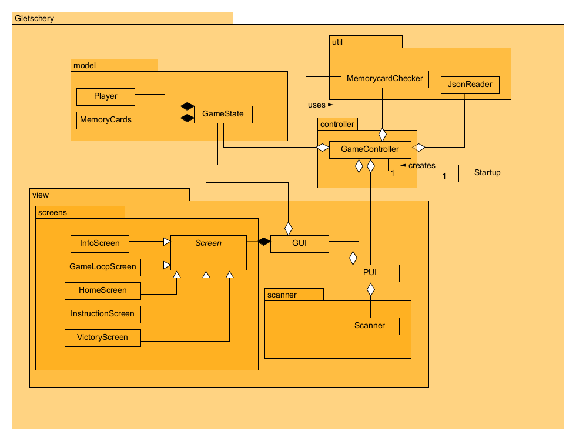

[[section-design-decisions]]
== Architekturentscheidungen
=== MVC

Für unser Projekt wurde aus verschiedenen Gründen entschieden eine MVC Architektur zu verwenden.
Im Folgenden werden die wichtigsten Gründe erwähnt.

1. **Wartbarkeit:**
* Dadurch, dass unser Projekt notfalls von einer externen Partei gewartet werden muss, ist es von Vorteil, wenn die Komponenten so wenige Abhängigkeiten wie möglich voneinander haben.
2. **Separation of Concerns (Trennung von Verantwortlichkeiten):**
* Die Aufteilung der einzelnen Komponenten führen dazu, dass die einzelnen Komponenten getestet werden können, ohne die Logik zu beeinflussen.
3. **Testbarkeit:**
* Unit-Tests können für Models und Controller einfacher geschrieben werden.
4. **User-Interface:**
* Dadurch, dass unser Spiel verschiedene Screens haben wird, welche die gleichen Daten anzeigen, ist eine MVC Architektur von Vorteil.

=== Klassendiagramm

Um die Struktur des Codes festzulegen, wurde ein Klassendiagramm erstellt. **Jede Schicht der MVC Architektur wird in einem eigenen Package** zusammengefasst.
Der Grund dafür ist die Sicherstellung, dass **keine Schichten übergreifende Relationen** entstehen.

=== Architecture Decisions

[cols="1,3" options="header"]
|===
|Name |Decision
|Gletscherbilder Speicher Ort| Die Gletscherbilder werden auf dem Raspberry-PI unter "/home/pi/Pictures" gespeichert, um einfach austauschbar zu sein.
|Scan Image Speicher Ort| Das Scan-Image wird während des Spiels hier abgelegt "/home/pi/Pictures".
|Löschen des letzten Scan Images| Sobald das Spiel beendet wurde soll das letzte Bild gelöscht werden um gegen keine Datenschutzrichtlinien zu verstossen.
|Json speicher Location| Das Json wird auf dem Raspberry-PI unter "/home/pi/Documents" gespeichert.
|Json aufbau | Das Json ist wie folgt aufgebaut
|Karten ID's | Die IDs der Karten sind ein String, welcher so aufgebaut ist: <Paar-ID><CardIdentifier>. Als CardIdentifier wird jeweils A oder B verwendet. z.B. "00A"
|Paar-ID| Die Paar-ID besteht immer aus 2 Zeichen
|Paar-ID Start| Die Vergabe der ID's startet bei 00
|===

