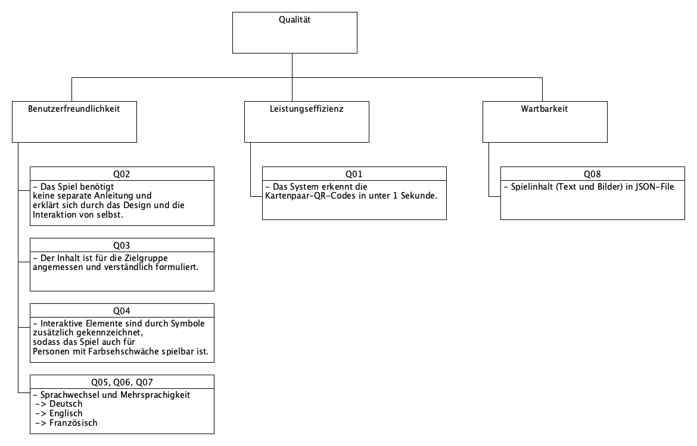

[[section-quality-scenarios]]
== Qualitätsanforderungen
.Einleitung
Diese Anforderungen dienen als Grundlage für die Architektur und unterstützen dabei, die Erwartungen der Stakeholder klar zu erfassen und gezielt umzusetzen.

=== Qualitätsbaum
Der Qualitätsbaum stellt alle Qualitätsanforderungen unseres Produktes übersichtlich dar. Wir haben uns dabei vor allem auf die Qualitätsziele **Leistungseffizienz**, **Benutzerfreundlichkeit** und **Wartbarkeit** fokussiert. Diese Qualitätsziele basieren auf den Vorgaben und Anforderungen des Kunden Primeo Energie.

=== Qualitätsanforderungen im Detail

[cols="1,2,4", options="header"]
|===
| Anforderung | Qualitätsanforderung | Beschreibung

| Q01
| Leistungseffizienz
| Das System erkennt die Kartenpaar-QR-Codes in unter 1 Sekunde.

| Q02
| Benutzerfreundlichkeit
| Das Spiel benötigt keine separate Anleitung und erklärt sich durch das Design und die Interaktion von selbst.

| Q03
| Benutzerfreundlichkeit
| Der Inhalt ist für die Zielgruppe angemessen und verständlich formuliert.

| Q04
| Benutzerfreundlichkeit
| Interaktive Elemente sind durch Symbole zusätzlich gekennzeichnet, sodass das Spiel auch für Personen mit Farbsehschwäche spielbar ist.

| Q05
| Benutzerfreundlichkeit
| Das Spiel ist in mehreren Sprachen verfügbar und kann vor dem Start des Spiels ausgewählt werden.

| Q06
| Benutzerfreundlichkeit
| Die Menüstruktur ist in allen Sprachen konsistent und übersichtlich.

| Q07
| Benutzerfreundlichkeit
| Alle Inhalte sind in den Sprachen Deutsch, Englisch und Französisch verfügbar.

| Q08
| Wartbarkeit
| Die Spielinhalte (Texte und Bilder) sind in einer externen JSON-Datei abgelegt und können ohne Änderung des Quellcodes angepasst werden.
|===

[.small]
-> *QS-01* prüft *Q01 (Leistungseffizienz)*

-> *QS-02* prüft *Q02 (Benutzerfreundlichkeit – selbsterklärende Bedienung)*

-> *QS-03* prüft *Q03 (Benutzerfreundlichkeit – Angemessenheit der Sprache im Spiel)*

-> *QS-04* prüft *Q04 (Benutzerfreundlichkeit – Barrierefreiheit)*

-> *QS-05* prüft *Q05 (Benutzerfreundlichkeit – Sprachwahl)*

-> *QS-06* prüft *Q06 (Benutzerfreundlichkeit – konsistente Menüstruktur)*

-> *QS-07* prüft *Q07 (Benutzerfreundlichkeit – Inhalte in mehreren Sprachen anzeigen)*

-> *QS-08* prüft *Q08 (Wartbarkeit – Anpassungen an der JSON-Datei)*

=== Qualitätsszenarien

[cols="1,2,2,2,2", options="header"]
|===
| ID | Stimulus | Umgebung | Reaktion des Systems | Erfolgskriterium

| QS-01
| Ein Spieler deckt eine Karte bei schwachen Lichtverhältnissen auf.
| Umgebungslicht ohne direkte Beleuchtung
| Das System erkennt den QR-Code innerhalb einer Sekunde.
| QR-Code wird in 95 % der Fälle korrekt erkannt

| QS-02
| Ein Benutzer startet das Spiel zum ersten Mal.
| Kein Vorwissen über Spiel oder Steuerung
| Der Spieler findet sich im Menü zurecht und startet das Spiel ohne Hilfe.
| 90 % der Testpersonen benötigen keine Erklärung

| QS-03
| Ein Spieler liest den Infotext über einen Gletscher im Spiel
| Spiel läuft in deutscher Sprache
| Die Texte sind altersgerecht und leicht verständlich formuliert.
| Mindestens 90 % der Testpersonen (entspricht 9 von 10) verstehen die Inhalte ohne Rückfragen.

| QS-04
| Ein farbenblinder Spieler nutzt das System.
| Spiel läuft im Normalbetrieb
| Alle interaktiven Elemente sind auch durch Symbole eindeutig erkennbar.
| Der Spieler kann ohne Probleme durch das Spiel navigieren.

| QS-05
| Eine Spielerin möchte das Spiel auf Französisch nutzen.
| Sprache im Startmenü auf Französisch gestellt
| Alle Menüs und Texte erscheinen in korrekter französischer Übersetzung.
| Keine fehlenden oder unübersetzten Texte sind zu sehen

| QS-06
| Ein Spieler wechselt zwischen Deutsch, Englisch und Französisch.
| Menüführung in den verschiedenen Sprachen (Deutsch, Englisch und Französisch) jeweils ausgewählt.
| Menüstruktur bleibt in allen Sprachen identisch aufgebaut.
| Kein Unterschied in Navigationsstruktur oder Position von Buttons

| QS-07
| Ein Schüler spielt das Spiel auf Englisch.
| Englische Sprache im Startmenü ausgewählt
| Alle Inhalte (Texte und Buttons) erscheinen korrekt übersetzt.
| Alle Inhalte erscheinen in der gewünschten Sprache

| QS-08
| Neue Inhalte (Bilder, Texte) sollen eingepflegt werden.
| Ein Entwickler aktualisiert die JSON-Datei mit neuen Inhalten.
| Die neuen Inhalte werden beim nächsten Spielstart korrekt angezeigt.
| Die Änderungen erfolgen ohne Codeanpassung und das Spiel startet fehlerfrei.
|===